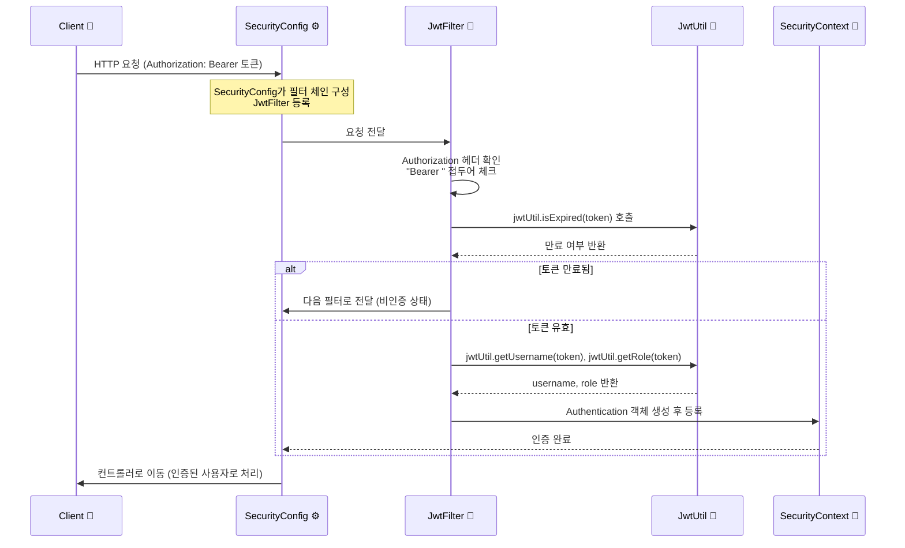

# Spring Boot Setting
---


# Console Log
---


# Result
---


---


---


---


---

### Access Token 검증

---

> POST | localhost:8080/login

Token 값 복사


---

> GET | localhost:8080/api/hello

Token 값 붙여넣기


---

### Redis FrontEnd Test

---


---


---

# Tree
---
```
src
└── main
    ├── java
    │   └── com
    │       └── example
    │           └── springrefresh
    │               ├── 📄 SpringrefreshApplication.java   # 메인 실행 파일
    │               │
    │               ├── 📂 util
    │               │   └── 🔑 JwtUtil.java                # JWT 생성/검증 유틸
    │               │
    │               ├── 📂 filter
    │               │   └── 🧹 JwtFilter.java              # JWT 인증 필터
    │               │
    │               ├── 📂 config
    │               │   └── ⚙️ SecurityConfig.java         # Spring Security 설정
    │               │
    │               ├── 📂 controller
    │               │   └── 🎮 AuthController.java         # 로그인/회원가입 API
    │               │
    │               ├── 📂 service
    │               │   └── 🛠️ AuthService.java            # 인증 관련 비즈니스 로직
    │               │
    │               ├── 📂 domain
    │               │   └── 👤 User.java                   # 사용자 엔티티 (DB와 연결)
    │               │
    │               └── 📂 repository
    │                   └── 💾 UserRepository.java         # 사용자 DB 접근 JPA
    │
    └── resources
        ├── 📄 application.yml                             # 환경 설정 (JWT secret, DB, 포트 등)
        └── 📂 static                                      # 정적 파일(css/js/html)
```

## 🚀 설명 (이모지 버전)

```
📄 = 일반 파일
📂 = 폴더
🔑 = 보안/암호 관련 (JWT)
🧹 = 필터(Filter 역할)
⚙️ = 설정/Config
🎮 = 컨트롤러(API 엔드포인트)
🛠️ = 서비스(비즈니스 로직)
👤 = 사용자/엔티티
💾 = 데이터베이스
```

--- 

<details>
<summary>📑 Code (펼치기/접기)</summary>

---

## 🔑 JwtUtil.java (JWT 토큰 도구)

```java
// JwtUtil.java
package com.example.springrefresh.util;

import io.jsonwebtoken.Claims;
import io.jsonwebtoken.Jwts;
import io.jsonwebtoken.security.Keys;
import org.springframework.beans.factory.annotation.Value;
import org.springframework.stereotype.Component;

import javax.crypto.SecretKey;
import java.nio.charset.StandardCharsets;
import java.util.Date;

@Component // 스프링이 자동으로 관리하는 Bean 등록
public class JwtUtil {

    private final SecretKey secretKey;       // 토큰 암호화/복호화에 쓰는 비밀키
    private final Long accessExpirationMs;   // Access Token 만료 시간
    private final Long refreshExpirationMs;  // Refresh Token 만료 시간

    // 생성자: application.yml 값들을 불러와 초기화
    public JwtUtil(
            @Value("${jwt.secret}") String secret,
            @Value("${jwt.access-token-expiration}") Long accessExpirationMs,
            @Value("${jwt.refresh-token-expiration}") Long refreshExpirationMs
    ) {
        this.secretKey = Keys.hmacShaKeyFor(secret.getBytes(StandardCharsets.UTF_8));
        this.accessExpirationMs = accessExpirationMs;
        this.refreshExpirationMs = refreshExpirationMs;
    }

    // 토큰 생성 메서드
    public String createToken(String username, String role, String type) {
        Date now = new Date();
        Long expiration = type.equals("access") ? accessExpirationMs : refreshExpirationMs;
        Date expiryDate = new Date(now.getTime() + expiration);

        return Jwts.builder()
                .subject(username)
                .claim("username", username)
                .claim("role", role)
                .issuedAt(now)
                .expiration(expiryDate)
                .signWith(secretKey)
                .compact();
    }

    // 토큰 정보(Claims) 추출
    public Claims getClaims(String token) {
        return Jwts.parser().verifyWith(secretKey)
                .build().parseSignedClaims(token).getPayload();
    }

    // 토큰에서 username 꺼내기
    public String getUsername(String token) {
        return getClaims(token).get("username", String.class);
    }

    // 토큰에서 role 꺼내기
    public String getRole(String token) {
        return getClaims(token).get("role", String.class);
    }

    // 토큰 만료 여부 확인
    public boolean isExpired(String token) {
        Date expiration = getClaims(token).getExpiration();
        return expiration.before(new Date()); // 만료 시간이 현재 시간보다 이전이면 true
    }
}
```

--- 

## 🧹 JwtFilter.java (JWT 인증 필터)

```java
// JwtFilter.java
package com.example.springrefresh.filter;

import com.example.springrefresh.util.JwtUtil;
import jakarta.servlet.FilterChain;
import jakarta.servlet.ServletException;
import jakarta.servlet.http.HttpServletRequest;
import jakarta.servlet.http.HttpServletResponse;
import lombok.RequiredArgsConstructor;
import org.springframework.security.authentication.UsernamePasswordAuthenticationToken;
import org.springframework.security.core.Authentication;
import org.springframework.security.core.authority.SimpleGrantedAuthority;
import org.springframework.security.core.context.SecurityContextHolder;
import org.springframework.security.core.userdetails.User;
import org.springframework.web.filter.OncePerRequestFilter;

import java.io.IOException;
import java.util.List;

@RequiredArgsConstructor
public class JwtFilter extends OncePerRequestFilter {

    private final JwtUtil jwtUtil; // JwtUtil 도구 의존성 주입

    @Override
    protected void doFilterInternal(HttpServletRequest request,
                                    HttpServletResponse response,
                                    FilterChain filterChain)
            throws ServletException, IOException {

        // 1. 요청 헤더에서 Authorization 값 꺼내기
        String authorization = request.getHeader("Authorization");

        // 2. 토큰이 없거나 Bearer 스킴이 아니면 통과
        if (authorization == null || !authorization.startsWith("Bearer ")) {
            filterChain.doFilter(request, response);
            return;
        }

        // 3. Bearer 부분 잘라내고 실제 토큰만 추출
        String accessToken = authorization.substring("Bearer ".length());

        // 4. 토큰이 만료되었으면 통과 (인증 실패)
        if (jwtUtil.isExpired(accessToken)) {
            filterChain.doFilter(request, response);
            return;
        }

        // 5. 토큰에서 사용자 정보 꺼내기
        String username = jwtUtil.getUsername(accessToken);
        String role = jwtUtil.getRole(accessToken);

        // 6. UserDetails 생성 (스프링 시큐리티에서 쓰는 사용자 객체)
        User user = new User(username, "", List.of(new SimpleGrantedAuthority(role)));

        // 7. Authentication 객체 생성 후 SecurityContext에 등록
        Authentication authToken =
                new UsernamePasswordAuthenticationToken(user, null, user.getAuthorities());
        SecurityContextHolder.getContext().setAuthentication(authToken);

        // 8. 다음 필터로 요청 전달
        filterChain.doFilter(request, response);
    }
}
```

---

## ⚙️ SecurityConfig.java (보안 설정)

```java
package com.example.springrefresh.config;

import com.example.springrefresh.filter.JwtFilter;
import com.example.springrefresh.util.JwtUtil;
import lombok.RequiredArgsConstructor;
import org.springframework.context.annotation.Bean;
import org.springframework.context.annotation.Configuration;
import org.springframework.security.authentication.AuthenticationManager;
import org.springframework.security.config.annotation.authentication.configuration.AuthenticationConfiguration;
import org.springframework.security.config.annotation.web.builders.HttpSecurity;
import org.springframework.security.config.annotation.web.configuration.EnableWebSecurity;
import org.springframework.security.config.annotation.web.configurers.AbstractHttpConfigurer;
import org.springframework.security.config.http.SessionCreationPolicy;
import org.springframework.security.core.userdetails.User;
import org.springframework.security.core.userdetails.UserDetails;
import org.springframework.security.core.userdetails.UserDetailsService;
import org.springframework.security.crypto.factory.PasswordEncoderFactories;
import org.springframework.security.crypto.password.PasswordEncoder;
import org.springframework.security.provisioning.InMemoryUserDetailsManager;
import org.springframework.security.web.SecurityFilterChain;
import org.springframework.security.web.authentication.UsernamePasswordAuthenticationFilter;
import org.springframework.web.cors.CorsConfiguration;
import org.springframework.web.cors.CorsConfigurationSource;
import org.springframework.web.cors.UrlBasedCorsConfigurationSource;

import java.util.List;

@Configuration // 설정 클래스
@EnableWebSecurity // 스프링 시큐리티 활성화
@RequiredArgsConstructor
public class SecurityConfig {
    private final JwtUtil jwtUtil; // JwtUtil 주입

    @Bean
    public SecurityFilterChain filterChain(HttpSecurity http) throws Exception {
        // 1. CORS 허용
        http.cors(cors -> cors.configurationSource(corsConfigurationSource()));

        // 2. 기본 보안 기능 끄기 (JWT만 사용)
        http.csrf(AbstractHttpConfigurer::disable)
            .formLogin(AbstractHttpConfigurer::disable)
            .httpBasic(AbstractHttpConfigurer::disable);

        // 3. 세션 대신 JWT만 사용
        http.sessionManagement(session ->
                session.sessionCreationPolicy(SessionCreationPolicy.STATELESS));

        // 4. 경로별 권한 설정
        http.authorizeHttpRequests(auth -> auth
                .requestMatchers("/", "/login", "/reissue").permitAll() // 누구나 접근 가능
                .requestMatchers("/api/**").hasRole("USER")             // USER 권한 필요
                .anyRequest().authenticated()                           // 나머지는 로그인 필요
        );

        // 5. JwtFilter 추가 (UPAF 앞에 실행)
        http.addFilterBefore(new JwtFilter(jwtUtil), UsernamePasswordAuthenticationFilter.class);

        return http.build();
    }

    // 비밀번호 암호화 도구
    @Bean
    public PasswordEncoder passwordEncoder() {
        return PasswordEncoderFactories.createDelegatingPasswordEncoder();
    }

    // 메모리 사용자 저장소 (테스트용)
    @Bean
    public UserDetailsService userDetailsService() {
        UserDetails user = User.builder()
                .username("user") // 아이디: user
                .password(passwordEncoder().encode("1234")) // 비번: 1234
                .roles("USER")
                .build();
        return new InMemoryUserDetailsManager(user);
    }

    // 인증 관리자
    @Bean
    public AuthenticationManager authenticationManager(AuthenticationConfiguration configuration) throws Exception {
        return configuration.getAuthenticationManager();
    }

    // CORS 설정
    @Bean
    public CorsConfigurationSource corsConfigurationSource() {
        CorsConfiguration config = new CorsConfiguration();
        config.setAllowedOrigins(List.of("http://127.0.0.1:5500")); // 허용 출처
        config.setAllowedMethods(List.of("*")); // 모든 메서드 허용
        config.setAllowedHeaders(List.of("*")); // 모든 헤더 허용
        config.setAllowCredentials(true); // 인증정보 허용
        config.setMaxAge(3600L); // 캐싱 시간 1시간

        UrlBasedCorsConfigurationSource source = new UrlBasedCorsConfigurationSource();
        source.registerCorsConfiguration("/**", config);
        return source;
    }
}
```

---

## 📝 SecurityConfig 인증 흐름도


---

## 📝 JWT 3개 클래스 관계도


---

## 📝 JWT 인증 전체 흐름 (Client → Server)



</details>
